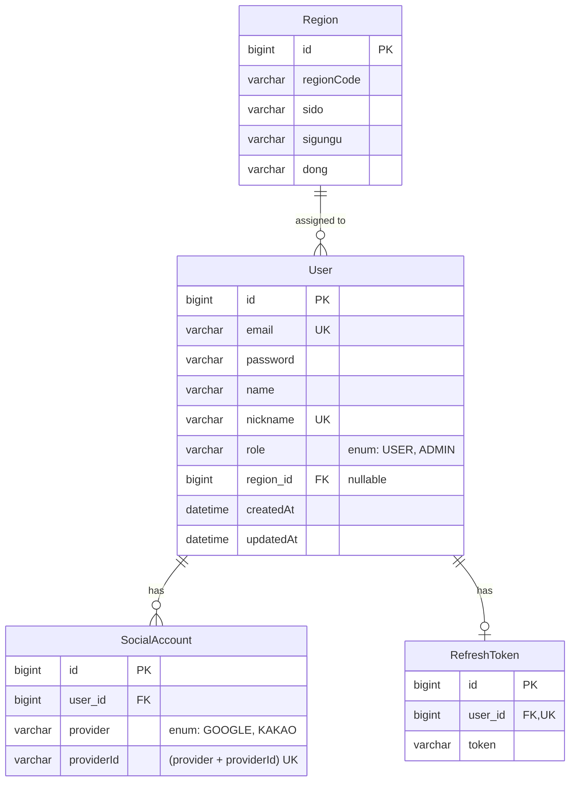
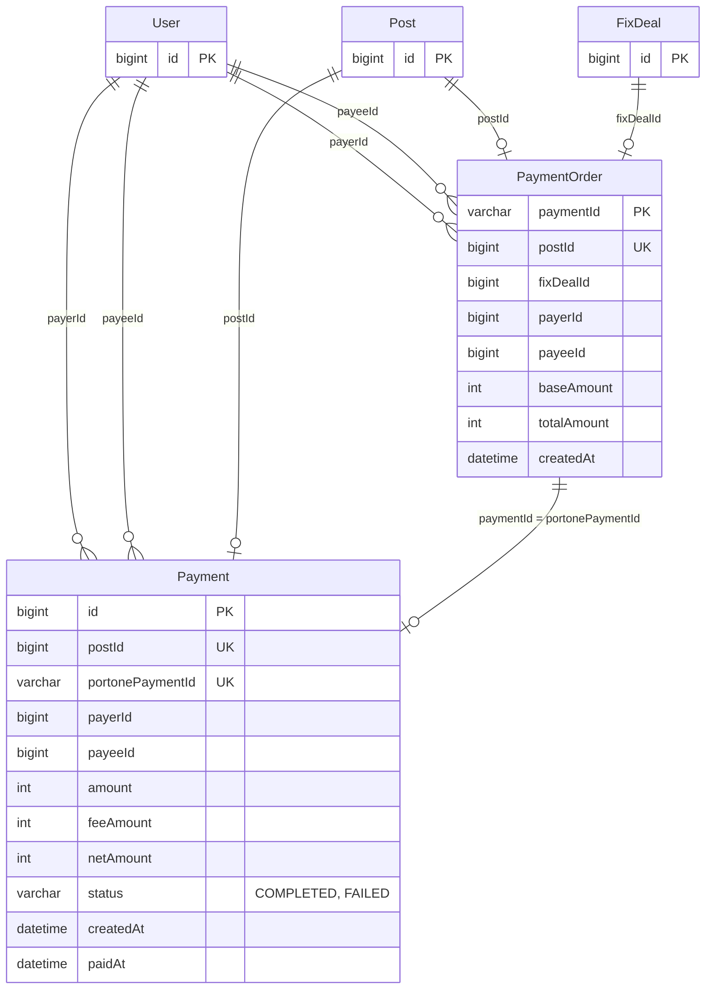
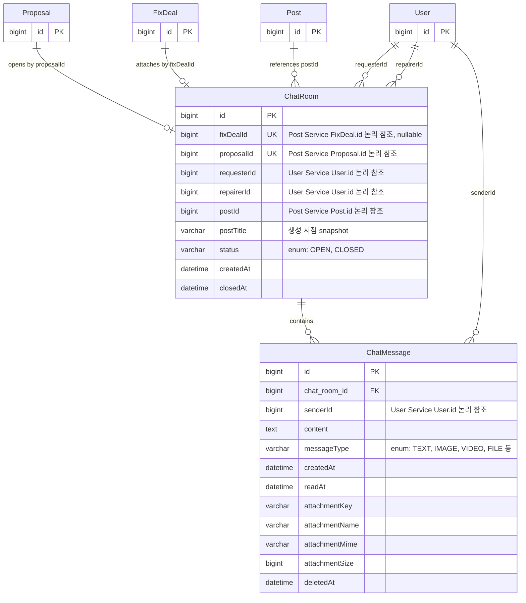

# ERD 정의서

## 관계 원칙

- Foreign Key는 같은 Service DB 안에서만 사용합니다.
- 다른 Service ID는 논리 참조입니다.
- 생성 시점 값이 필요하면 Snapshot 목적과 갱신 금지를 명시합니다.
- 상태 전이와 Unique·Transaction 근거를 업무 규칙과 실제 Test에 연결합니다.

1. user-service ERD

1. post-service ERD

```mermaid
erDiagram
    %% User는 user-service 소유
    %% Post Service에서는 User.id / User.email을 논리 참조하며 실제 FK는 사용하지 않음

    User {
        bigint id PK
        varchar email UK
    }

    Post {
        bigint id PK
        varchar title
        text content
        varchar authorEmail "User.email 논리 참조"
        varchar regionName
        varchar regionCode
        boolean publiclyVisible
        varchar category "enum: PostCategory"
        varchar status "enum: WAITING, MATCHED, COMPLETED"
        datetime createdAt
        datetime updatedAt
    }

    PostImage {
        bigint id PK
        bigint post_id FK
        varchar imageUrl
        varchar storedFileName
        int sortOrder
        datetime createdAt
    }

    Proposal {
        bigint id PK
        bigint post_id FK
        varchar repairerEmail "User.email 논리 참조"
        int estimatedPrice
        text content
        boolean isAdopted
        boolean attachResume
    }

    FixDeal {
        bigint id PK
        bigint postId "Post.id"
        bigint proposalId "Proposal.id"
        bigint requesterId "User.id 논리 참조"
        bigint repairerId "User.id 논리 참조"
        varchar status "enum: FixDealStatus"
        datetime createdAt
        datetime completedAt
    }

    RepairContract {
        bigint id PK
        bigint chatRoomId "Chat Service ChatRoom.id 논리 참조"
        int revision "(chatRoomId+revision) UK"
        bigint authorId "User.id 논리 참조"
        longtext termsJson
        varchar documentHash
        varchar status "DRAFT/SIGNING/SIGNED/SUPERSEDED"
        datetime createdAt
        datetime requestedAt
        datetime signedAt
    }

    ContractSignature {
        bigint id PK
        bigint contract_id FK
        bigint signerId "User.id 논리 참조"
        varchar signerName
        varchar documentHash
        varchar consentText
        datetime signedAt
    }

    Review {
        bigint id PK
        bigint postId UK "Post.id"
        varchar reviewerEmail "User.email 논리 참조"
        varchar revieweeEmail "User.email 논리 참조"
        int rating
        varchar content
        datetime createdAt
    }

    ReviewImage {
        bigint id PK
        bigint review_id FK
        varchar imageUrl
        varchar storedFileName
        int sortOrder
        datetime createdAt
    }

    Report {
        bigint id PK
        varchar targetType "enum: POST, USER"
        bigint targetId "Post.id 또는 외부 User.id 논리 참조"
        varchar targetEmail "User.email 논리 참조"
        varchar reporterEmail "User.email 논리 참조"
        varchar reason "enum"
        text detail
        varchar status "enum: PENDING, RESOLVED, DISMISSED"
        datetime createdAt
    }

    Resume {
        bigint id PK
        varchar userEmail UK "User.email 논리 참조"
        varchar headline
        varchar introduction
        datetime createdAt
        datetime updatedAt
    }

    ResumeCareer {
        bigint id PK
        bigint resume_id FK
        varchar period
        varchar description
        int sortOrder
    }

    ResumeSkill {
        bigint resume_id FK
        varchar skillName
        int sortOrder
    }

    Notification {
        bigint id PK
        varchar recipientEmail "User.email 논리 참조"
        varchar type "enum"
        bigint postId "nullable"
        bigint proposalId "nullable"
        bigint chatRoomId "Chat Service ChatRoom.id 논리 참조, nullable"
        varchar message
        boolean isRead
        datetime createdAt
    }

    NotificationSetting {
        bigint id PK
        varchar userEmail UK "User.email 논리 참조"
        boolean proposalReceived
        boolean proposalAdopted
        boolean chatMessage
    }

    User ||--o{ Post : "writes"
    Post ||--o{ PostImage : "has"
    Post ||--o{ Proposal : "receives"

    Post ||--o| FixDeal : "results in"
    Proposal ||--o| FixDeal : "adopted into"

    User ||--o{ FixDeal : "requests"
    User ||--o{ FixDeal : "repairs"

    RepairContract ||--o{ ContractSignature : "signed by"
    User ||--o{ ContractSignature : "signs"

    Post ||--o| Review : "gets"
    User ||--o{ Review : "writes"
    User ||--o{ Review : "receives"
    Review ||--o{ ReviewImage : "has"

    User ||--o{ Report : "reports"
    Post ||--o{ Report : "is reported"

    User ||--o| Resume : "has"
    Resume ||--o{ ResumeCareer : "has"
    Resume ||--o{ ResumeSkill : "has"

    User ||--o{ Notification : "receives"
    User ||--o| NotificationSetting : "has"
```

1. payment-service ERD

1. chat-service

