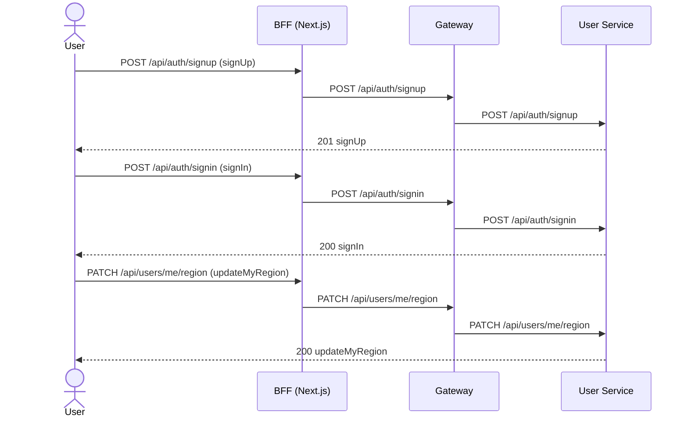
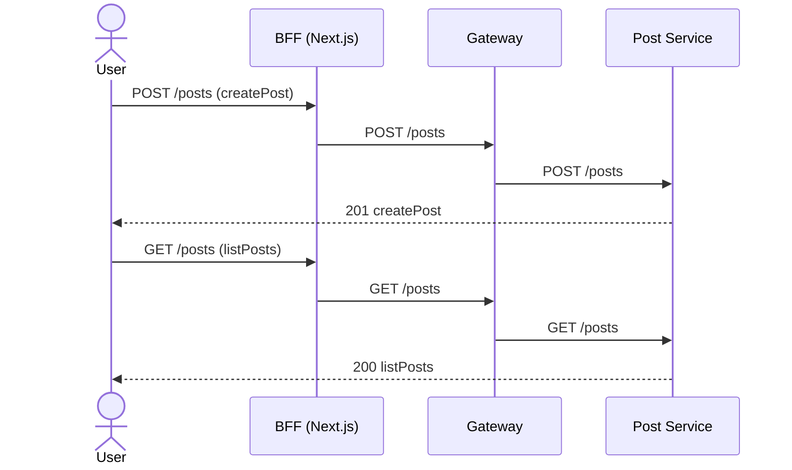
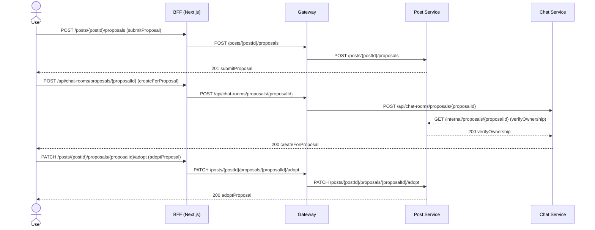
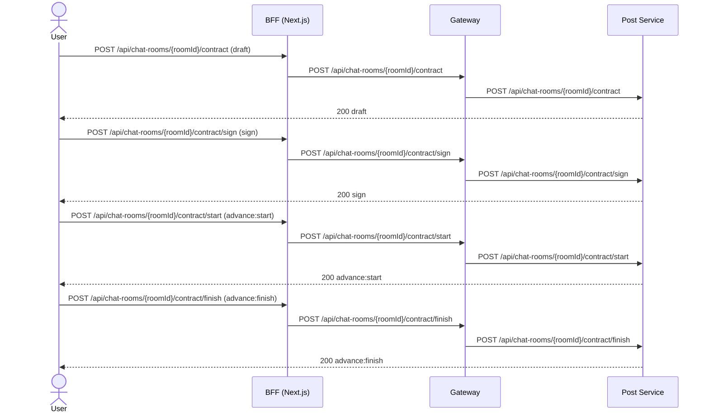
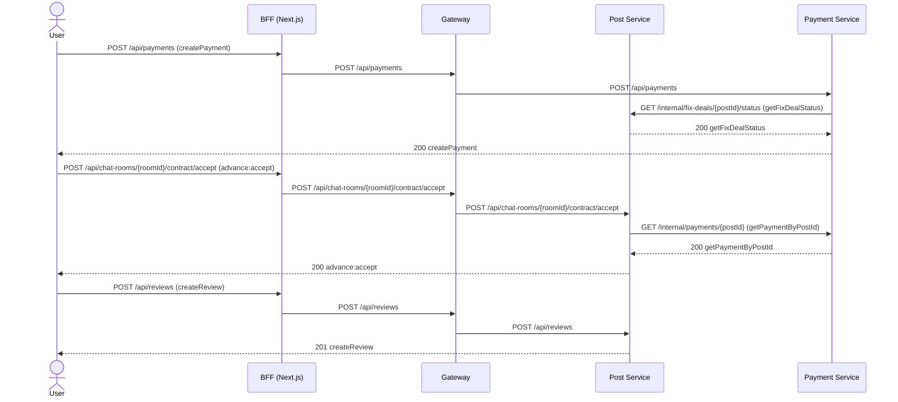

# [양식] 시퀀스

> **작성·동기화 메타정보**
> Notion 원본 URL: `[팀 Notion 페이지 URL]`
> Snapshot 기준 시점: `Sprint 2 Review 종료 시점`
> 동기화 시각: `2026-09-22 (실제 동기화 시각으로 교체)`
> 직접 편집 금지: Git Snapshot은 직접 편집하지 않고 Notion 원본을 수정한 뒤 다시 동기화합니다.

> 계약: [API 문서·OpenAPI 링크]
> 관련 Story·Sprint 검증: [GitHub Issue·테스트 전략 링크]

## 정상 흐름

### 회원가입·로그인·활동 지역 설정 (Story #1, #2)

### 게시글 등록·조회 (Story #3)

### 수리 제안 등록·채택 전 채팅·채택 (Story #7, #8)

### 계약서 작성·서명·수리 진행 (Story #9, #10, #11)

### 결제·완료 확정·후기 (Story #12, #13, #14)

## 실패·복구 흐름

| 시작 조건 | 관련 업무 규칙·계약 | 실패 지점 | 안전한 결과 | 재시도·복구 | 관련 Test·Sprint Demo |
| --- | --- | --- | --- | --- | --- |
| 결제 미완료 상태에서 "완료 확정" 클릭 | `POST .../contract/accept` | 결제 상태가 COMPLETED가 아님 | 409, 상태 변경 없음 | 결제 완료 후 재시도 | [링크] |
| 결제 확인 요청(`POST /api/payments`)과 PortOne 웹훅이 동시 도착 | `portonePaymentId` UNIQUE 제약 | 같은 결제 건을 양쪽이 동시에 저장 시도 | 한쪽만 성공, 다른 쪽 409 `DUPLICATE_PAYMENT` | 프론트가 실패로 안내하지 않고 결제 상태 재조회 → 이미 결제된 것으로 처리 | [링크] |
| 두 사용자가 같은 제안을 동시에 채택 시도 | 게시글·제안 row 비관적 락 | 동시 `adopt` 요청 경합 | 한 건만 성공, 나머지 409 | 실패한 쪽에 "이미 채택된 글입니다" 안내 | [링크] |
| AI 계약서 초안 응답 대기 중 상대방이 새 계약 버전을 저장 | `baseId` 버전 일치 검증 | 응답 시점 기준 버전 불일치 | 409, AI 결과 폐기 | 최신 버전 다시 불러와 재요청 | [링크] |
| Gemini 서비스 혼잡·호출 한도 초과 | `GeminiClient.generate` | 429/503 응답 | `PROVIDER_BUSY` / `AI_UNAVAILABLE`, 입력값은 유지 | 잠시 후 재시도 또는 직접 작성으로 전환 | [링크] |
| AI가 계약 항목에 근거 없는 금액·날짜를 생성 | `validateContract`(sourceId/quote 대조) | 인용문이 실제 출처에 없거나 서버 필드를 AI가 임의 생성 | 422, 초안 반환하지 않음 | 서버가 애초에 `totalAmount`/`startDate`/`endDate`는 AI 응답을 무시하고 직접 채움 | [링크] |
| 이미 채택되었거나 채팅방이 있는 제안을 삭제 시도 | `deleteProposal` | 상태 조건 불충족 | 409, 삭제되지 않음 | 해당 없음(정책상 항상 거부) | [링크] |

시퀀스에서 Payload를 다시 정의하지 않습니다. 호출 순서에는 실제 `operationId`, method/path, Event 이름을 사용합니다.
