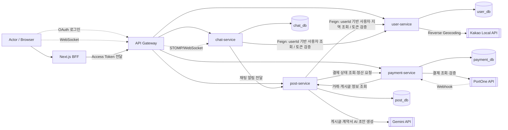

# 아키텍처 정의서

## 1. 현재 실행 구조



---

## 2. 아키텍처 개요

Mokoco는 기능별 책임과 데이터 소유권을 분리한 MSA 구조로 구성한다.

현재 Backend는 다음 5개 주요 Component로 구성한다.

- API Gateway
- user-service
- post-service
- chat-service
- payment-service

각 Service는 자신의 DB를 독립적으로 소유하며 다른 Service의 DB에 직접 접근하지 않는다.

다른 Service의 데이터가 필요한 경우 해당 Service가 제공하는 내부 API를 호출하고, 서비스 간 관계는 DB Foreign Key가 아닌 `userId`, `postId`, `proposalId`, `fixDealId` 등의 논리적 ID로 참조한다.

---

## 3. Component 책임

| Component | 책임 | 소유 데이터 | 관련 Story·계약 | 상태 | 비고 |
| --- | --- | --- | --- | --- | --- |
| Next.js BFF | Browser 요청 처리, 인증 Token 전달, Frontend와 Backend 연결 | 없음 | 전체 Story 공통 | 구현 중/완료 | Backend Entity 또는 DB를 직접 참조하지 않음 |
| API Gateway | 서비스별 Route 관리, CORS, WebSocket Route 제공 | 없음 | 전체 Story 공통 | 구현 완료 | `/ws/chat`은 chat-service로 Route |
| user-service | 회원가입·로그인, OAuth2, JWT 검증, 사용자·권한·상태 관리, 활동 지역 관리 | `user_db` | 회원·인증·지역 Story | 구현 완료 | 사용자 식별자는 서비스 간 `userId(Long)` 사용 |
| post-service | 게시글, 제안, 제안 채택, FixDeal, 계약, 후기, 이력서, 프로필, 신고, 거래 상태 관리, AI 작성 지원 | `post_db` | 게시글·제안·거래·계약 Story | 구현 완료/개선 중 | 거래 도메인의 Source of Truth |
| chat-service | ChatRoom, ChatMessage, 실시간 메시지 송수신, WebSocket/STOMP, 첨부파일, 채팅 접근 권한 | `chat_db` | 채팅 Story | 분리 구현 완료/개선 중 | 기존 post-service의 채팅 책임을 독립 Service로 분리 |
| payment-service | PortOne 결제 생성·검증, 에스크로 결제 정보, 수수료 계산, 정산, Webhook 처리 | `payment_db` | 결제·정산 Story | 구현 완료 | PortOne 응답은 서버 간 재검증 |

---

# 4. 데이터 소유권

서비스 간 데이터 소유권은 다음과 같이 정의한다.

| Service | 소유 데이터 | 생성·변경 책임 | 다른 Service에서 참조 | 직접 DB 접근 |
| --- | --- | --- | --- | --- |
| user-service | User, 인증, Role, Region | user-service | `userId` + 내부 API | 금지 |
| post-service | Post, Proposal, FixDeal, Contract, Review, Resume, Report | post-service | `postId`, `proposalId`, `fixDealId` + 내부 API | 금지 |
| chat-service | ChatRoom, ChatMessage | chat-service | `chatRoomId` + 내부 API | 금지 |
| payment-service | Payment, Settlement 관련 정보 | payment-service | 거래 ID 및 API 계약 | 금지 |

---

---

# 5. Service 호출 방향

| 호출 주체 → 대상 | 계약 | 왜 이 방향인가 | Timeout·실패 시 사용자 결과 |
| --- | --- | --- | --- |
| Client/BFF → API Gateway | HTTP/REST | 외부 Backend 진입점을 Gateway로 통합 | Gateway 장애 시 Backend 기능 이용 불가 |
| Client → Gateway → chat-service | WebSocket/STOMP | 실시간 통신 책임을 chat-service가 소유 | 연결 실패 안내 및 재연결 |
| post-service → user-service | `userId` 기준 사용자·지역 조회 및 Token 검증 | User 데이터의 Source of Truth가 user-service | 사용자 정보 확인 실패 시 관련 요청 실패 |
| chat-service → user-service | JWT 검증, `userId` 기반 사용자 조회 | 인증 및 User 데이터는 user-service 소유 | CONNECT 실패 또는 `401/403` 처리 |
| post-service → chat-service | Proposal/FixDeal Context 기반 ChatRoom 생성·동기화 | 거래 조건 판단은 post-service, ChatRoom 생성 책임은 chat-service | 채팅방 생성 실패. 재시도·멱등성 처리 필요 |
| chat-service → post-service | 채팅 메시지 관련 알림 전달 | 알림 기능이 post-service 영역에 존재 | 알림 실패 시 메시지는 저장하고 알림만 누락 가능 |
| payment-service → post-service | FixDeal·거래 상태 확인 | 거래 상태의 Source of Truth가 post-service | 확인 실패 시 결제 진행 중단 |
| post-service → payment-service | 결제 여부 조회, 정산 요청 | Payment 데이터는 payment-service 소유 | 결제 확인 실패 시 거래 상태 전이 차단 |
| payment-service → PortOne | 결제 정보 서버 재조회 | Client 결제 결과를 신뢰하지 않기 위함 | 결제 검증 실패 및 사용자 재시도 안내 |
| post-service → Gemini | 게시글·계약 초안 생성 | AI 보조 기능 | AI 기능만 실패하고 핵심 거래 기능은 유지 |

---

# 6. 데이터베이스 관리

각 Service는 별도의 MySQL Database를 사용한다.

```
user-service
    └─ user_db

post-service
    └─ post_db

chat-service
    └─ chat_db

payment-service
    └─ payment_db
```

모든 Service는 Flyway를 사용하여 Schema 변경 이력을 관리한다.

```yaml
spring:
  flyway:
    enabled: true

  jpa:
    hibernate:
      ddl-auto: validate
```

운영 Schema 변경은 Hibernate 자동 생성에 의존하지 않고 Migration Script를 통해 관리한다.

---

# 7. 외부 서비스

| 외부 서비스 | 호출 Service | 용도 | 실패 영향 |
| --- | --- | --- | --- |
| Kakao Local API | user-service | 좌표 → 행정구역 Reverse Geocoding | 자동 지역 설정 실패, 수동 설정 가능 |
| PortOne API | payment-service | 결제 및 결제 결과 검증 | 결제 진행·확인 실패 |
| Gemini API | post-service | 게시글 및 계약 AI 초안 생성 | AI 보조 기능만 사용 불가 |
| Google/Kakao OAuth | user-service | Social Login | 해당 OAuth 로그인만 일시 사용 불가 |

---

# 8. 장애 격리 원칙

외부 Service 장애가 전체 거래 데이터 손상으로 이어지지 않도록 다음 원칙을 적용한다.

### Chat Notification 실패

```
ChatMessage 저장 성공
        ↓
알림 호출
        ↓
실패
        ↓
메시지 Rollback 하지 않음
```

알림은 부가 기능이므로 알림 Service 호출 실패가 채팅 메시지 저장 실패로 이어지지 않도록 한다.

### 결제 확인 실패

```
payment-service 조회 실패
        ↓
거래 상태 전이 차단
```

결제 여부는 거래 상태 변경의 핵심 조건이므로 결제 상태를 확인하지 못한 경우 상태 변경을 허용하지 않는다.

### AI 호출 실패

```
Gemini 호출 실패
        ↓
AI 초안 기능 실패
        ↓
수동 작성 가능
```

AI 기능은 사용자 보조 기능이며 게시글 또는 계약의 필수 의존성으로 만들지 않는다.

---

# 9. 인증 및 내부 Service 통신

외부 사용자는 API Gateway를 통해 Backend 기능을 요청한다.

Service 간 내부 통신에는 사용자 요청과 구분할 수 있는 내부 인증 정책을 적용한다.

```
External Request
Client
  ↓
API Gateway
  ↓
Service

Internal Request
Service
  ↓
Internal API + Service Key
  ↓
Target Service
```

API Gateway에서는 외부 사용자가 다음 내부 Header를 임의 주입하지 못하도록 제거한다.

```
X-Internal-Service-Key
```

서비스 내부 통신은 별도의 Internal Endpoint와 Service Key를 사용하여 일반 사용자 요청과 구분한다.

---

# 10. 주요 아키텍처 결정 기록

| 결정 | 근거가 된 사용자 시나리오·위험 | 선택 | 검토 대안 | Sprint |
| --- | --- | --- | --- | --- |
| VWorld → Kakao Local API 변경 | 배포 환경에서 VWorld 호출 제한으로 활동 지역 설정 실패 가능 | Kakao Local API 사용 | VWorld 유지 및 Proxy 구성 | Sprint 2 |
| Service 간 사용자 식별 Email → `userId(Long)` | Email 변경 시 여러 Service의 참조 데이터 동기화 문제 | 내부 식별자 userId 사용 | Email 계속 사용 | Sprint 3 |
| Service 별 DB 독립 소유 | 하나의 DB를 공유하면 Schema와 배포가 강하게 결합됨 | Service별 DB 분리 | Shared DB | Sprint 3 |
| Service 간 DB 직접 접근 금지 | 다른 Service DB 변경 시 서비스 독립성이 깨짐 | API/DTO + ID 논리 참조 | DB 직접 JOIN 또는 공용 Entity | Sprint 3 |
| FixDeal을 post-service가 소유 | Proposal 채택 직후 거래가 생성되며 매칭·거래 상태가 밀접하게 연결됨 | post-service가 FixDeal 관리 | payment-service 또는 별도 deal-service | Sprint 2 |
| ChatRoom/ChatMessage를 chat-service로 분리 | 거래 Domain과 실시간 통신 Domain의 책임 및 Traffic 특성이 다름 | chat-service 독립 분리 | post-service에 채팅 유지 | Sprint 3 |
| 채팅 데이터는 외부 Entity 대신 ID만 저장 | ChatRoom이 User/FixDeal Entity를 참조하면 Service 간 JPA 결합 발생 | `userId`, `fixDealId`, `proposalId` 논리 참조 | Cross-Service FK / Entity 공유 | Sprint 3 |
| ChatRoom 생성 멱등성 보장 | Network 재시도나 중복 요청으로 같은 거래에 여러 ChatRoom 생성 가능 | Unique Constraint + 기존 Room 반환 | Application 조회만 수행 | Sprint 3 |
| WebSocket 인증을 chat-service가 직접 검증 | 장시간 연결에서 최초 인증만으로는 만료·권한 변경 대응이 어려움 | CONNECT 및 SEND/SUBSCRIBE에서 검증 | CONNECT 시 1회만 인증 | Sprint 3 |
| 결제 검증을 Client 응답이 아닌 PortOne Server 조회 결과로 수행 | Client 응답 위·변조 위험 | payment-service에서 PortOne 재조회 | Frontend 결과 신뢰 | Sprint 2 |
| 결제 완료 여부를 Webhook과 사용자 확인 요청에서 이중 확인 | Browser 응답 유실 및 Webhook 지연 가능 | 양쪽 요청에서 서버 재조회 + 멱등 저장 | Webhook 또는 Front 확인 중 하나만 사용 | Sprint 2 |
| 플랫폼 수수료를 의뢰자에게 추가 청구 | 수리자가 제안한 금액과 실제 정산액이 달라지는 문제 방지 | 수리자 제안금액 그대로 정산 | 수리자 정산금에서 수수료 차감 | Sprint 2 |
| 결제 시점을 계약 서명 직후로 변경 | 결제 전에 작업이 수행되는 신뢰 문제 | 서명 → 결제 → 작업 시작 | 수리 완료 이후 결제 | Sprint 3 |
| 거래 상태 전이 책임을 하나의 Domain Logic으로 통합 | 여러 Endpoint가 상태를 각각 변경하면 결제·계약 조건을 우회할 수 있음 | 통합된 상태 전이 규칙 사용 | 여러 Service/Controller에서 직접 상태 변경 | Sprint 3 |
| Gemini 핵심 거래값 생성 제한 | AI Hallucination이 계약 금액·일정 분쟁으로 이어질 위험 | 금액·날짜는 서버 값 사용 | AI 응답 전체 신뢰 | Sprint 3 |
| 이력서 공개를 Proposal별 Opt-in으로 관리 | 모든 제안에서 수리자의 이력서가 자동 노출되는 개인정보·사용성 문제 | `attachResume` 선택 | 프로필 공개 여부에 따라 전체 공개 | Sprint 3 |
